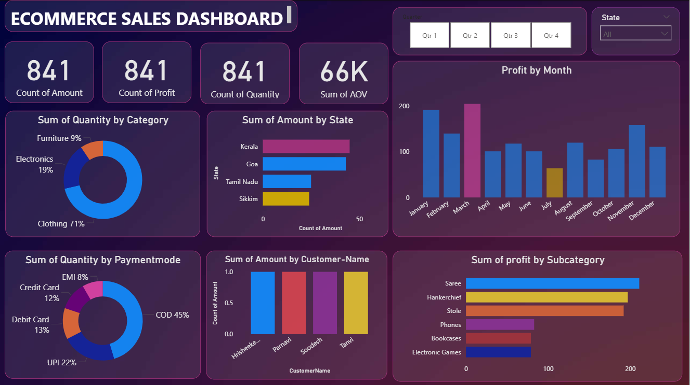
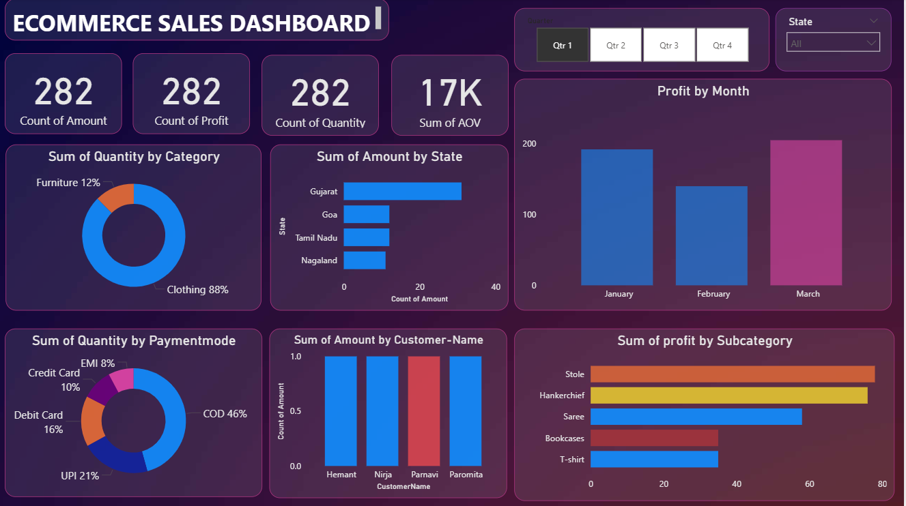
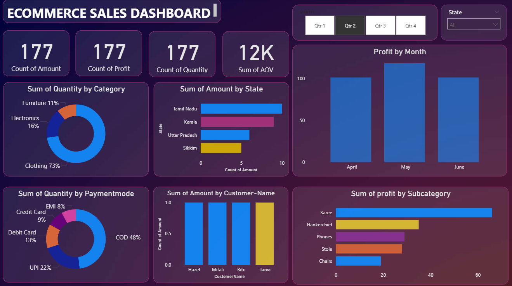
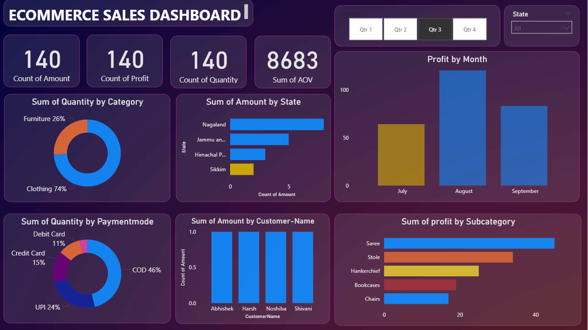
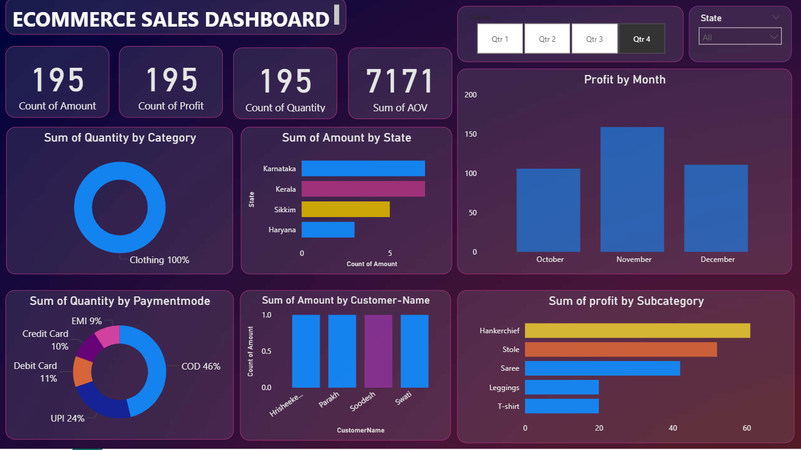
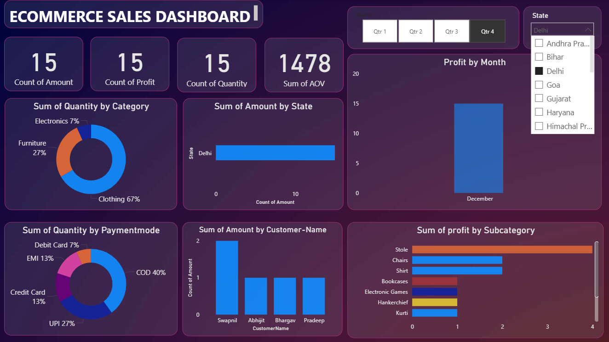

# 🛒 Ecommerce Sales Dashboard – Power BI

An interactive **Power BI data analytics dashboard** developed to analyze ecommerce sales data. The project focuses on transforming raw ecommerce data into meaningful insights through **data cleaning, analysis, visualization, and interactive dashboard design**.

The dashboard helps understand sales performance, customer behavior, product categories, payment methods, profit, quantity sold, and other business-related patterns.

---

## 📊 Project Overview

The **Ecommerce Sales Dashboard** provides a visual analysis of ecommerce sales data using Microsoft Power BI.

The project follows a complete data analytics workflow:

**Raw Data → Data Cleaning → Data Analysis → Data Visualization → Interactive Power BI Dashboard**

The dashboard is designed to make ecommerce business information easier to understand and help identify important sales patterns and trends.

---

## 🎯 Objectives

* Analyze ecommerce sales performance.
* Understand sales and profit across different categories.
* Analyze customer purchasing patterns.
* Compare product categories and sub-categories.
* Identify high-performing products and categories.
* Analyze payment methods and their usage.
* Understand sales and profit trends.
* Create interactive and visually appealing Power BI reports.
* Convert raw ecommerce data into meaningful business insights.

---

## 🛠️ Tools & Technologies

* **Microsoft Power BI** – Dashboard development and visualization
* **Power Query** – Data cleaning and transformation
* **DAX** – Calculated measures and data analysis
* **Microsoft Excel / CSV** – Dataset handling
* **Data Visualization** – Charts, cards, tables and interactive visuals

---

## 📊 Dashboard Preview

### Dashboard 1



### Dashboard 2



### Dashboard 3



### Dashboard 4



### Dashboard 5




### Dashboard 6




---

## 📁 Repository Structure

```text
Ecommerce-Sales-Dashboard-using-PowerBI/
│
├── Dataset/
│   └── Ecommerce Sales Dataset
│
├── Images/
│   └── Dashboard screenshots
│
├── PowerBI File/
│   └── Ecommerce Sales Dashboard.pbix
│
├── LICENSE
│
└── README.md
